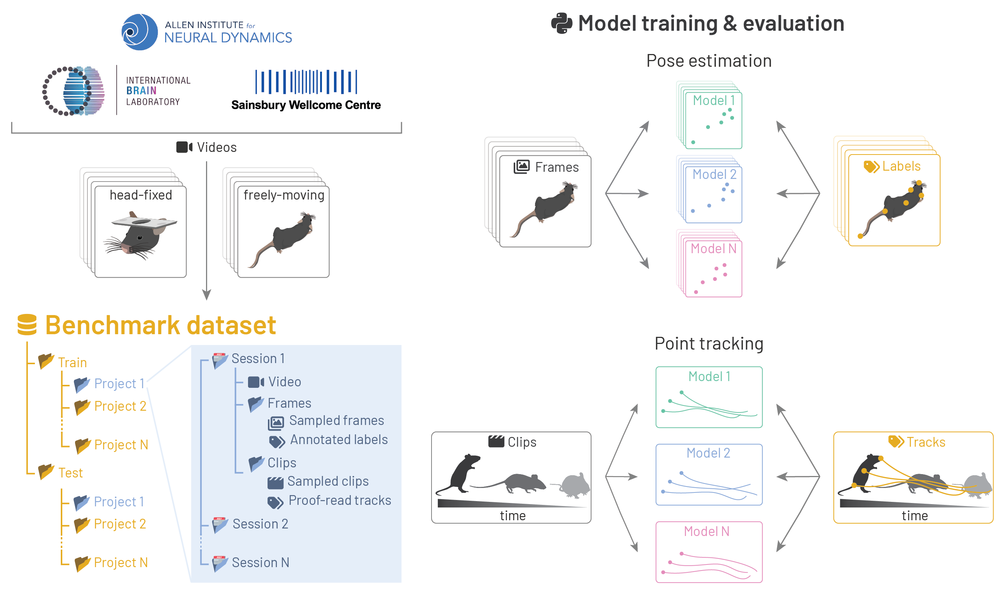

(target-poseinterface)=
# poseinterface

::::{grid} 1 2 2 4
:gutter: 3

:::{grid-item-card} {fas}`info-circle;sd-text-primary` About
:link: about
:link-type: doc

Learn about the project's mission, team and how to contribute.
:::

:::{grid-item-card} {fas}`database;sd-text-primary` Benchmark dataset
:link: benchmark-dataset
:link-type: doc

Folder structure and file naming conventions for benchmark datasets.
:::

:::{grid-item-card} {fas}`code;sd-text-primary` Examples
:link: auto_examples/index
:link-type: doc

A gallery of examples using `poseinterface`.
:::

:::{grid-item-card} {fas}`book;sd-text-primary` API reference
:link: api_index
:link-type: doc

Public functions and classes in `poseinterface`.
:::
::::



**poseinterface** exists to advance pose estimation and point tracking
applications in animal behaviour videos. The project aims to provide
benchmark datasets, baseline models trained on those datasets, as well as
tools for running and comparing pose estimation and tracking methods.

```{toctree}
:maxdepth: 2
:hidden:

about
benchmark-dataset
auto_examples/index
api_index
```
